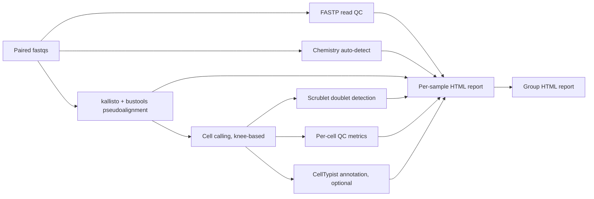

# scq: SingleCell Quick QC

[](https://github.com/Fazizzz/Low-Compute-SingleCell-QC-Nextflow-Pipeline/actions/workflows/ci.yml)
[](https://opensource.org/licenses/MIT)
[](https://www.nextflow.io/)

Low-compute Nextflow DSL2 pipeline for fast quality control of single-cell RNA-seq libraries. Runs on a laptop in quick mode for integrity checks and compute-cost prediction, scales to HPC or cloud in full mode for 10x Cell Ranger comparable count matrices. Outputs self-contained interactive HTML reports plus Cell Ranger style MTX matrices ready for scanpy or Seurat.

The pipeline is validated on public 10x Genomics 3' v3 datasets generated on both Element AVITI and Illumina NextSeq 2000 instruments, exercising multi-platform pseudoalignment, automatic chemistry detection, and reproducing the published scCLEAN (Jumpcode) CRISPR-Cas9 transcript depletion signal in PBMC samples. Library scales from 1,000 to 10,000 cells per sample (65 to 520 million reads) run end-to-end in quick mode on a 16 GB laptop. Full mode produces Cell Ranger comparable count matrices on AWS m6i.4xlarge for roughly one US dollar per sample.

## Contents

- [Workflow](#workflow)
- [Features](#features)
- [Modes](#modes)
- [Key dependencies](#key-dependencies)
- [Install](#install)
- [Usage](#usage)
- [Input and output formats](#input-and-output-formats)
- [Docker containers](#docker-containers)
- [Roadmap](#roadmap)
- [License](#license)
- [References](#references)
- [Acknowledgements](#acknowledgements)

## Workflow



*Figure 1: Pipeline stages. FASTP, chemistry detection, and pseudoalignment run in parallel per sample. Cell calling, doublet detection, QC metrics, and CellTypist annotation chain from the count matrix. All artifacts converge into per-sample HTML reports, which feed the multi-sample group report.*

## Features

- Cell Ranger style outputs (MTX, barcodes, genes) compatible with scanpy and Seurat without conversion.
- Self-contained interactive HTML reports with Plotly figures, no static asset hosting needed.
- Automatic chemistry detection across 10x 3' v3, 10x 3' v2, and Drop-seq layouts.
- Validated on multiple sequencing platforms (Element AVITI, Illumina NextSeq 2000) using shared 10x 3' v3 chemistry.
- Two compute envelopes from the same codebase: laptop friendly quick mode for integrity checks, HPC or cloud full mode for production-grade matrices.
- Resilient by default: per-task retry and graceful skip for FASTP failures, so one bad fastq does not block other samples.
- Profile based resource model so the same `nextflow run` invocation works on a 16 GB laptop, a 64 GB HPC node, or a tuned AWS instance.

## Modes

| Mode | Index | Reads captured | Memory | Typical use |
|---|---|---|---|---|
| `--workflow quick` (default) | cDNA only, ~1 GB | ~50 to 60 percent of input reads | fits 16 GB hosts | Library QC, doublet rate, mitochondrial fraction, compute-cost prediction before a full run |
| `--workflow full` | nac (spliced + nascent), ~7 GB for human | ~80 to 85 percent of input reads | 32 GB minimum, 64 GB recommended | Cell Ranger comparable UMI counts for downstream scanpy or Seurat analysis |

Quick mode is the recommended first pass for any new sample. It produces a complete report at a fraction of the cost and surfaces failures (low cell count, high doublet flag, chemistry mismatch) before you commit to the full run.

## Key dependencies

- [Nextflow](https://www.nextflow.io/) 24.10.x (pinned via `NXF_VER`; 26.x is not yet compatible with the publishDir patterns used here).
- [kallisto](https://pachterlab.github.io/kallisto/) 0.51.1 and [bustools](https://bustools.github.io/) 0.44.1, accessed via [kb-python](https://github.com/pachterlab/kb_python) 0.29.5.
- [fastp](https://github.com/OpenGene/fastp) 1.3+ for read-level QC.
- [scanpy](https://scanpy.readthedocs.io/) for matrix handling and the `scanpy.pp.scrublet` doublet wrapper.
- [CellTypist](https://www.celltypist.org/) (optional, enabled with `--run_celltypist`).
- Docker or Singularity if running with a containerized profile.

> **Agent operators:** see [AGENTS.md](AGENTS.md) for a structured operating guide. It documents profile selection, failure recovery patterns, the S3 warm-start convention for reusing pre-built indices, and the automation surface for autonomous runs.

> **CI status:** every push and pull request runs the pipeline in stub mode against both `--workflow quick` and `--workflow full` paths, plus a lint pass that resolves every profile (`local`, `hpc`, `aws`). See `.github/workflows/ci.yml`.

## Install

### Option A: conda environment (laptop or HPC login node)

```bash
git clone https://github.com/Fazizzz/Low-Compute-SingleCell-QC-Nextflow-Pipeline.git
cd Low-Compute-SingleCell-QC-Nextflow-Pipeline
conda env create -f envs/scq.yml
conda activate scq
export NXF_VER=24.10.6
```

For strict reproducibility, use `envs/scq.lock.yml` instead of `envs/scq.yml`. The lock file pins every dependency to the validated set.

### Option B: docker

```bash
docker build -f containers/sc_qc_base/Dockerfile -t sc_qc_base:latest .
docker build -f containers/sc_qc_annotate/Dockerfile -t sc_qc_annotate:latest .
```

Then invoke Nextflow with `-profile docker`. See the [Docker containers](#docker-containers) section for details.

### Option C: singularity

Convert the docker images to `.sif` (`singularity build sc_qc_base.sif docker-daemon://sc_qc_base:latest`) and invoke with `-profile singularity`.

## Usage

### Quick start (stub run, no data required, under 30 seconds)

```bash
nextflow run main.nf -stub-run \
    --samplesheet test/samplesheet.csv \
    --prebuilt_index ref/index.idx --t2g ref/t2g.txt
```

### Choose a compute profile, then a container engine

Profiles combine with commas: one compute envelope plus one container engine.

| Profile | Target host |
|---|---|
| `local` | Laptop or desktop, up to 16 GB RAM. Quick mode only. |
| `hpc` | HPC node or workstation with 32 GB RAM and 16+ cores. Full mode capable. |
| `aws` | EC2 m6i.4xlarge (16 vCPU, 64 GB RAM). Validated reference instance. |
| `docker` | Use the `sc_qc_base` / `sc_qc_annotate` docker images. |
| `singularity` | Use the `.sif` images. |

### Real run examples

Laptop, quick mode, conda env on PATH:

```bash
nextflow run main.nf -profile local \
    --samplesheet test/samplesheet.csv \
    --prebuilt_index ref/index.idx --t2g ref/t2g.txt
```

HPC, full mode, singularity:

```bash
nextflow run main.nf -profile hpc,singularity --workflow full \
    --samplesheet samples.csv \
    --prebuilt_index nac.idx --t2g t2g.txt \
    --cdna_t2c cdna_t2c.txt --nascent_t2c nascent_t2c.txt
```

AWS, full mode, docker, with CellTypist annotation:

```bash
nextflow run main.nf -profile aws,docker --workflow full \
    --samplesheet samples.csv \
    --prebuilt_index nac.idx --t2g t2g.txt \
    --cdna_t2c cdna_t2c.txt --nascent_t2c cdna_t2c.txt \
    --run_celltypist --celltypist_model_path Immune_All_Low.pkl
```

Standalone shell wrappers for every pipeline stage live under `scripts/shell/` if you need to run individual steps outside Nextflow.

## Input and output formats

### Samplesheet

```csv
sample_id,fastq_r1,fastq_r2,chemistry,species
PBMC_01,/data/PBMC_01_R1.fastq.gz,/data/PBMC_01_R2.fastq.gz,10xv3,human
```

`chemistry` accepts `10xv2`, `10xv3`, `10xv3.1`, `dropseq`. `species` accepts `human` or `mouse`. Both fields are validated at run start.

### Outputs

```
results/
├── group_report.html
├── pipeline_info/
│   ├── trace.txt
│   ├── execution_report.html
│   ├── timeline.html
│   ├── software_versions.yml
│   └── samplesheet.validated.csv
└── <sample_id>/
    ├── <sample_id>_report.html
    ├── filtered_matrix/                          # Cell Ranger MTX (genes by cells)
    ├── <sample_id>_cell_calling.json
    ├── <sample_id>_knee_data.json
    ├── fastp/<sample_id>_fastp.{json,html}
    ├── chemistry/<sample_id>_chemistry.json
    ├── kb_count/                                 # kb count outputs
    ├── doublets/<sample_id>_doublet_{scores.csv,meta.json}
    ├── qc/<sample_id>_qc_{metrics.csv,summary.json}
    └── celltypist/<sample_id>_celltypist_{predictions.csv,meta.json}
```

### Group report

The group report opens with a pass/fail status table per sample, surfacing any warnings (low alignment, low cells called, doublet flag, chemistry mismatch) at the top.


*Figure 2: Group report header. The pass/fail table highlights any sample-level warnings that require attention before downstream analysis. In this example all four validation samples pass; the asterisk on alignment percentage marks quick-mode runs where intronic reads are expected to be missed.*

Below the status table, the group report shows per-sample bar charts for the key cross-sample metrics on a single page.


*Figure 3: Group report cross-sample comparison. Bars show cells called, median UMIs per cell, median genes per cell, median percent mitochondrial reads, percent pseudoaligned, and doublet rate. The sea-green and complementary palette accommodates up to 12 samples without color reuse; runs with more than 20 samples fall back to a compact summary table automatically.*

### Per-sample report

Each sample report includes a top-line summary, the FASTP read QC panel, the alignment summary with mode-aware caveats, the barcode rank knee plot, per-cell UMI, gene, mitochondrial percent and doublet score distributions, and an optional CellTypist composition panel.


*Figure 4: Per-sample summary section. Cells called, median UMIs, median genes, mitochondrial fraction, pseudoalignment percentage, and the auto-detected knee threshold sit at the top of every sample report. The asterisk note on quick-mode alignment reminds the reader that intronic reads are not counted in that mode.*


*Figure 5: Per-sample alignment and FASTP detail. Total reads, Q30 rate, duplication fraction, and full pseudoalignment counts let users sanity-check chemistry detection and library prep before trusting the cell-level metrics.*

When CellTypist is enabled, each sample receives a cell-type composition bar chart using the same expanded palette as the group plots.


*Figure 6: CellTypist composition for a PBMC sample using the Immune_All_Low model. Categorical bars use the 12-color sea-green-anchored palette, with black-outlined bars matching the group report style.*

### Compute and resource usage

Every report footer summarizes compute usage so users can predict the cost of a future run on the same hardware.


*Figure 7: Compute and resource usage table at the end of every per-sample report. Wall time, peak CPU percent, peak memory, requested CPUs, and requested memory per step provide a compute receipt; this is the basis of the cost prediction described in AGENTS.md (typically about one US dollar per sample in full mode on AWS m6i.4xlarge).*

## Docker containers

Two images, both built from the repo:

| Image | Built from | Purpose |
|---|---|---|
| `sc_qc_base` | `containers/sc_qc_base/Dockerfile` | Base image with kallisto, bustools, fastp, kb-python, scanpy, scrublet, and the python report helpers. Used by every process except CellTypist annotation. |
| `sc_qc_annotate` | `containers/sc_qc_annotate/Dockerfile` | Extends `sc_qc_base` with CellTypist and its model-loading dependencies. Used only by `CELLTYPIST_ANNOTATE`. |

The split keeps the celltypist torch and onnx footprint out of the base image, which keeps the docker layer pulled to compute nodes small.

To build both:

```bash
docker build -f containers/sc_qc_base/Dockerfile     -t sc_qc_base:latest     .
docker build -f containers/sc_qc_annotate/Dockerfile -t sc_qc_annotate:latest .
```

Memory caps are not baked into the images. They are controlled by the Nextflow compute profile (`local`, `hpc`, or `aws`). The same image runs everywhere; only the resource envelope changes.

## Roadmap

- **nf-core submission.** Align directory layout, schema, and test data to the [nf-core](https://nf-co.re/) standard and submit for community review.
- **Broader organism coverage.** Validate on mouse and zebrafish reference indices, add species-aware mitochondrial gene lists.
- **Chemistry validation.** Extend the chemistry detector and validate on Parse Biosciences, 10x 3' v4, and BD Rhapsody outputs.
- **Terraform module for HPC bootstrap.** A one-command Terraform plan that provisions a transient AWS or GCP node sized for full mode, runs the pipeline, ships results to object storage, and tears the node down. Captures the validated reference instance type and the warm-start S3 layout documented in AGENTS.md.
- **Wiki gallery.** Browsable comparison of quick mode vs full mode reports for the four validation samples, plus the scCLEAN pseudo-experiment results.

## License

This project is released under the [MIT License](LICENSE). See `LICENSE` for the full text.

## References

- Bray, N. L., Pimentel, H., Melsted, P., and Pachter, L. (2016). Near-optimal probabilistic RNA-seq quantification. *Nature Biotechnology*, 34, 525 to 527. [doi:10.1038/nbt.3519](https://doi.org/10.1038/nbt.3519)
- Melsted, P., Booeshaghi, A. S., Liu, L., et al. (2021). Modular, efficient and constant-memory single-cell RNA-seq preprocessing. *Nature Biotechnology*, 39, 813 to 818. [doi:10.1038/s41587-021-00870-2](https://doi.org/10.1038/s41587-021-00870-2)
- Wolock, S. L., Lopez, R., and Klein, A. M. (2019). Scrublet: computational identification of cell doublets in single-cell transcriptomic data. *Cell Systems*, 8(4), 281 to 291.e9. [doi:10.1016/j.cels.2018.11.005](https://doi.org/10.1016/j.cels.2018.11.005)
- Domínguez Conde, C., Xu, C., Jarvis, L. B., et al. (2022). Cross-tissue immune cell analysis reveals tissue-specific features in humans. *Science*, 376(6594). [doi:10.1126/science.abl5197](https://doi.org/10.1126/science.abl5197)
- Chen, S., Zhou, Y., Chen, Y., and Gu, J. (2018). fastp: an ultra-fast all-in-one FASTQ preprocessor. *Bioinformatics*, 34(17), i884 to i890. [doi:10.1093/bioinformatics/bty560](https://doi.org/10.1093/bioinformatics/bty560)
- Wolf, F. A., Angerer, P., and Theis, F. J. (2018). SCANPY: large-scale single-cell gene expression data analysis. *Genome Biology*, 19, 15. [doi:10.1186/s13059-017-1382-0](https://doi.org/10.1186/s13059-017-1382-0)
- Yu, L., Wang, X., Mu, Q., Tam, S. S. T., et al. (2024). scCLEAN improves the signal-to-noise ratio of single-cell transcriptomics by reducing noise from highly expressed genes. *Nature Communications*, 15, [scCLEAN paper]. The validation samples SRR33398036 (depleted) and SRR33398039 (control) are reused with thanks to the authors for the open release.
- Element Biosciences AVITI data (SRR21064278, SRR21064279) is reused from the public release accompanying the platform's initial single-cell demonstrators.
- Built with [Nextflow](https://www.nextflow.io/) and the conventions established by [nf-core](https://nf-co.re/). Thanks to the kallisto, bustools, and kb-python teams at the Pachter lab for the underlying alignment tooling.

## Acknowledgements

Muhammad Faizan Khalid: Author and current maintainer

This pipeline grew out of a desire to build something practical: a resource that enables everyday users to perform single-cell analysis at scale while remaining accessible for local, low-compute environments. It provides a framework for both small local analyses and larger-scale studies, acting as a training resource for users who want hands-on experience with downstream single-cell analysis. It also gives labs an opportunity to QC their data locally before committing to cloud costs.

The pipeline was developed as part of an ongoing portfolio in bioinformatics pipeline engineering, with a focus on single-cell sequencing, containerization, and QC resource development beyond the 10x Genomics ecosystem.

The pipeline architecture draws inspiration from the work of [Tommy Tang](https://www.youtube.com/watch?v=fVtiHHIvG-I), who provides several helpful resources on his [GitHub](https://github.com/crazyhottommy). It follows nf-core DSL2 module conventions, with intentional deviations documented in the codebase. The multi-sample framework and harmonized reporting tools reflect the kind of scalable approach needed in production sequencing environments handling tens to hundreds of samples.

This repository is provided for educational and demonstration purposes. It is not affiliated with Tommy Tang, nf-core, 10x Genomics, or any commercial organization. It includes well-commented scripts and a streamlined analysis workflow designed for low-compute environments, ease of use, and local implementation. It is not a commercial product. The code is provided "as is," without warranty of any kind. Bugs and feedback are welcome through the repository's issue tracker.

For citation or attribution, please reference:
Khalid, M. Faizan (or Khalid MF)

You can follow related research and professional updates via my [Google Scholar profile](https://scholar.google.com/citations?hl=en&user=qFZQ5wYAAAAJ&sortby=title&view_op=list_works&gmla=AL3_zigRWGX9g8Jc22idbBUMFuy7cVN_pEIyL6_DXSA-qWkJbcaONzhRNSmAwmQXKEm-3-WYGouZZC2pCE6zD9tZLxizbM7jQzzZMOgtkgsuL825u4lvSs9kwsccajhJbBg2Mrc37at_HCQ) or [LinkedIn](https://www.linkedin.com/in/m-faizan-khalid/).
